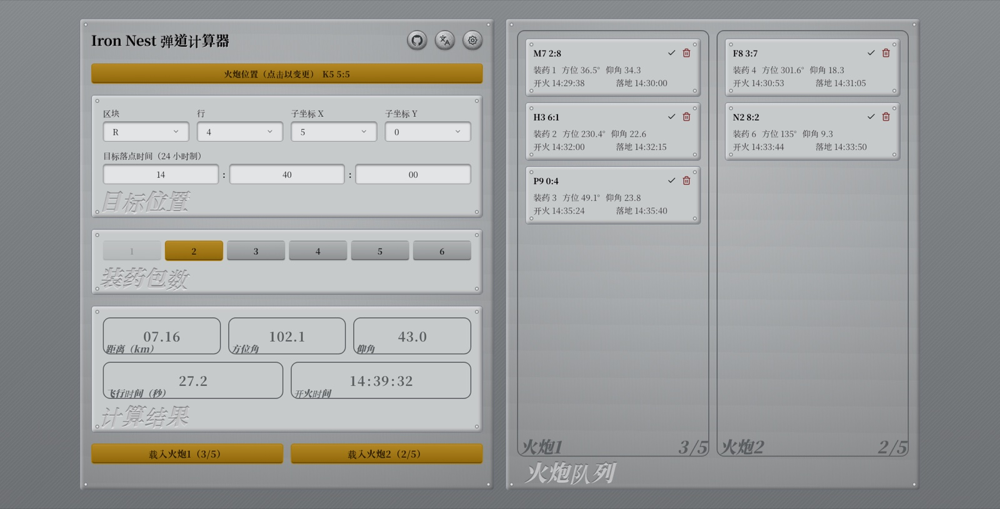

# Iron Nest Ballistics Calculator

[English](../README.md) · [繁體中文](README.zh-TW.md) · 简体中文 · [Français](README.fr.md) · [Deutsch](README.de.md) · [Español](README.es.md) · [Português (Brasil)](README.pt-BR.md) · [Українська](README.uk.md) · [日本語](README.ja.md) · [Русский](README.ru.md) · [한국어](README.ko.md) · [Čeština](README.cs.md) · [Polski](README.pl.md) · [Italiano](README.it.md) · [Español (Latinoamérica)](README.es-419.md) · [Türkçe](README.tr.md)



**[在线使用 →](https://rainmeocat.com/projects/iron-nest-ballistics-calculator)**

一个以 Vue 3 + TypeScript + Vite 打造的火炮弹道计算工具，可依炮位与目标坐标计算距离、方位角、仰角、飞行时间与开火时机，并管理两门炮的射击队列。界面支持 16 种语言。

## 使用方法

1. **设置炮位**：点击画面上方的「Gun Position」按钮，在弹出窗口中选择区块（A–T）、行（1–10）与子坐标（X/Y，0–9），设置炮台所在位置。
2. **设置目标坐标**：在「Target Position」面板中，以相同方式输入目标坐标。
3. **选择装药包数**：从 1–6 中选择装药量；超出射程（每包装药最大射程 5km）的选项会自动停用，若距离变化导致当前选择超出射程，系统会自动切换到可用值。
4. **（可选）设置目标命中时间**：在设置（齿轮图标）中开启「Enable impact time / fire time」，在「Target Impact Time」输入目标命中的 24 小时制时间，结果会反推对应的开火时间。
5. **查看计算结果**：「Results」面板实时显示：
   - **Distance**：炮位与目标的距离（km）
   - **Azimuth**：方位角
   - **Elevation**：仰角
   - **Flight Time**：飞行时间（秒，需开启命中时间功能）
   - **Fire Time**：开火时间（需开启命中时间功能）
6. **加入射击队列**：点击「Load Gun 1」或「Load Gun 2」，将当前的目标坐标、装药量、方位角、仰角与（若启用）开火/命中时间存入该炮的队列（每门炮最多 5 条）。可在队列面板将记录标记为已开火或删除。
7. **切换语言**：使用画面右上角的语言菜单切换界面语言，选择会保存于浏览器并于下次打开时记住。

## 开发环境设置

```bash
npm install
npm run dev
```

其他命令：

```bash
npm run build      # 类型检查并打包正式版本
npm run preview    # 预览打包后的正式版本
npm run lint        # 检查代码风格
npm run lint:fix    # 自动修复可修复的风格问题
npm run format      # 用 Prettier 格式化并修复 lint 问题
```

## 技术栈

- [Vue 3](https://vuejs.org/) `<script setup>` + TypeScript
- [Vite](https://vite.dev/)
- [Tailwind CSS](https://tailwindcss.com/)
- [vue-i18n](https://vue-i18n.intlify.dev/)
- [motion-v](https://motion.dev/) / [lucide-vue-next](https://lucide.dev/)
