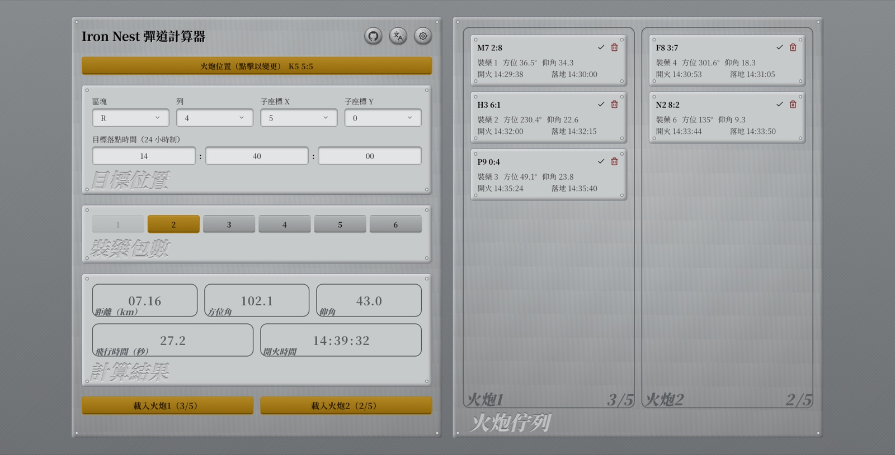

# Iron Nest Ballistics Calculator

[English](../README.md) · 繁體中文 · [简体中文](README.zh-CN.md) · [Français](README.fr.md) · [Deutsch](README.de.md) · [Español](README.es.md) · [Português (Brasil)](README.pt-BR.md) · [Українська](README.uk.md) · [日本語](README.ja.md) · [Русский](README.ru.md) · [한국어](README.ko.md) · [Čeština](README.cs.md) · [Polski](README.pl.md) · [Italiano](README.it.md) · [Español (Latinoamérica)](README.es-419.md) · [Türkçe](README.tr.md)



**[線上使用 →](https://rainmeocat.com/projects/iron-nest-ballistics-calculator)**

一個以 Vue 3 + TypeScript + Vite 打造的火砲彈道計算工具，可依砲位與目標座標計算距離、方位角、仰角、飛行時間與開火時機，並管理兩門砲的射擊佇列。介面支援 16 種語言。

## 使用方式

1. **設定砲位**：點擊畫面上方的「Gun Position」按鈕，於彈出視窗中選擇區塊（A–T）、列（1–10）與子座標（X/Y，0–9），設定砲台所在位置。
2. **設定目標座標**：在「Target Position」面板中，以相同方式輸入目標座標。
3. **選擇裝藥包數**：從 1–6 中選擇裝藥量；超出射程（每包裝藥最大射程 5km）的選項會自動停用，若距離變化導致目前選擇超出射程，系統會自動切換到可用值。
4. **（選用）設定目標命中時間**：於設定（齒輪圖示）中開啟「Enable impact time / fire time」，於「Target Impact Time」輸入目標命中的 24 小時制時間，結果會反推對應的開火時間。
5. **查看計算結果**：「Results」面板即時顯示：
   - **Distance**：砲位與目標的距離（km）
   - **Azimuth**：方位角
   - **Elevation**：仰角
   - **Flight Time**：飛行時間（秒，需開啟命中時間功能）
   - **Fire Time**：開火時間（需開啟命中時間功能）
6. **加入射擊佇列**：點擊「Load Gun 1」或「Load Gun 2」，將目前的目標座標、裝藥量、方位角、仰角與（若啟用）開火/命中時間存入該砲的佇列（每門砲最多 5 筆）。可在佇列面板將紀錄標記為已開火或刪除。
7. **切換語言**：使用畫面右上角的語言選單切換介面語言，選擇會儲存於瀏覽器並於下次開啟時記住。

## 開發環境設置

```bash
npm install
npm run dev
```

其他指令：

```bash
npm run build      # 型別檢查並打包正式版本
npm run preview    # 預覽打包後的正式版本
npm run lint        # 檢查程式碼風格
npm run lint:fix    # 自動修正可修復的風格問題
npm run format      # 以 Prettier 格式化並修正 lint 問題
```

## 技術棧

- [Vue 3](https://vuejs.org/) `<script setup>` + TypeScript
- [Vite](https://vite.dev/)
- [Tailwind CSS](https://tailwindcss.com/)
- [vue-i18n](https://vue-i18n.intlify.dev/)
- [motion-v](https://motion.dev/) / [lucide-vue-next](https://lucide.dev/)
